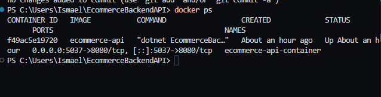
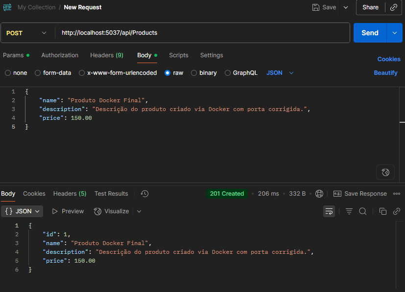
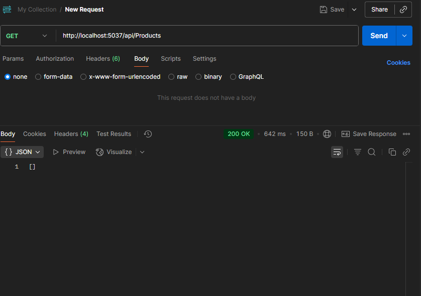
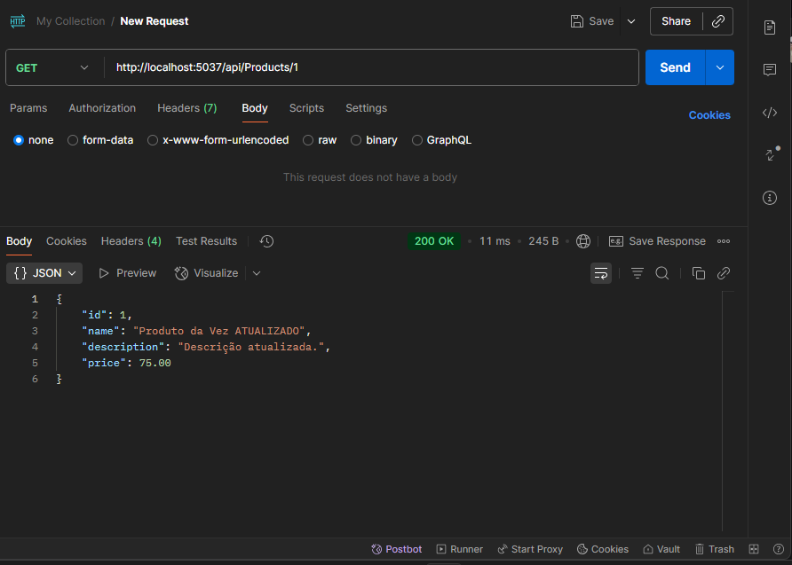
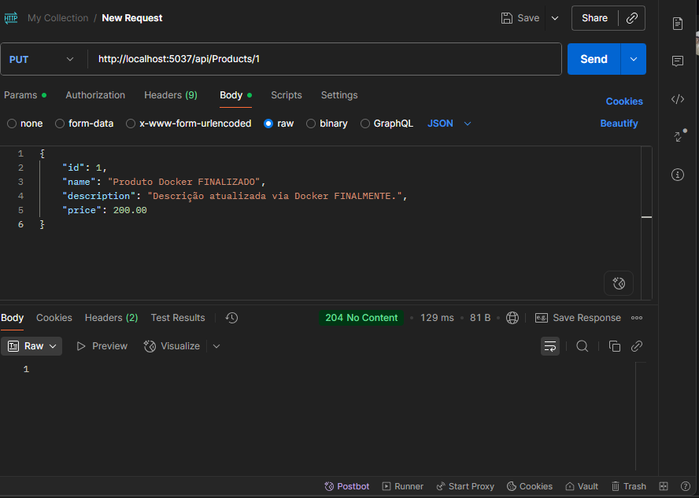
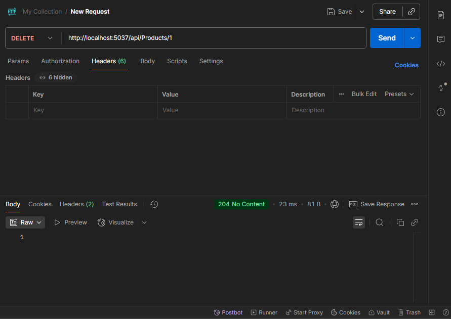

# EcommerceBackendAPI

Este é o backend da aplicação de e-commerce, desenvolvido em C# com .NET 8, que fornece uma API RESTful para gerenciar produtos. Ele se integra com o frontend `Ecommerce-RetroDrive` (do trabalho 2) para oferecer uma experiência completa de e-commerce.

## Funcionalidades

Este web service oferece as seguintes operações CRUD (Create, Read, Update, Delete) para a entidade `Product` (Produto):

* **`GET /api/Products`**: Lista todos os produtos.
* **`GET /api/Products/{id}`**: Retorna um produto específico pelo seu ID.
* **`POST /api/Products`**: Cria um novo produto.
* **`PUT /api/Products/{id}`**: Atualiza um produto existente.
* **`DELETE /api/Products/{id}`**: Exclui um produto.

Os dados são persistidos em um banco de dados **In-Memory** do .NET.

## Princípios SOLID

O projeto foi desenvolvido seguindo os princípios SOLID de programação orientada a objetos para garantir uma arquitetura modular, extensível e de fácil manutenção. 

## Como Rodar a Aplicação

A aplicação pode ser compilada e executada utilizando Docker.

### Pré-requisitos

* [Docker Desktop](https://www.docker.com/products/docker-desktop/) instalado e em execução.

### Passos para Rodar com Docker

1.  **Clone este repositório:**
    ```bash
    git clone https://github.com/ISM9182/EcommerceBackendAPI.git
    cd EcommerceBackendAPI
    ```

2.  **Construa a imagem Docker:**
    ```bash
    docker build -t ecommerce-api .
    ```
    *Se você tiver problemas de cache, pode tentar:*
    ```bash
    docker build -t ecommerce-api --no-cache .
    ```

3.  **Execute o contêiner Docker:**
    ```bash
    docker run -d -p 5037:8080 --name ecommerce-api-container ecommerce-api
    ```
    * A API estará disponível em `http://localhost:5037`.


## Evidências de Funcionamento (Prints de Tela)

Abaixo, demonstro o funcionamento da API com testes realizados via Postman, executando a aplicação a partir do contêiner Docker..


### 1. Verificação do Contêiner Docker

Este print confirma que o contêiner `ecommerce-api-container` está ativo e em execução, com o mapeamento de portas correto.



### 2. Criar Produto (POST /api/Products)

(IMAGEM DO POSTMAN MOSTRANDO A REQUISIÇÃO POST COM STATUS 201 E O CORPO DA RESPOSTA)


### 3. Listar Todos os Produtos (GET /api/Products)

(IMAGEM DO POSTMAN MOSTRANDO A REQUISIÇÃO GET ALL COM STATUS 200 E O CORPO DA RESPOSTA)


### 4. Buscar Produto por ID (GET /api/Products/{id})

(IMAGEM DO POSTMAN MOSTRANDO A REQUISIÇÃO GET BY ID COM STATUS 200 E O CORPO DA RESPOSTA)


### 5. Atualizar Produto (PUT /api/Products/{id})

(IMAGEM DO POSTMAN MOSTRANDO A REQUISIÇÃO PUT COM STATUS 204)


### 6. Deletar Produto (DELETE /api/Products/{id})

(IMAGEM DO POSTMAN MOSTRANDO A REQUISIÇÃO DELETE COM STATUS 204)



## Integração com o Frontend `Ecommerce-RetroDrive` (Trabalho 2)

Este backend foi cuidadosamente projetado para ser **compatível com a API esperada pelo frontend `Ecommerce-RetroDrive`**, desenvolvido no trabalho anterior.

**Sobre a Demonstração da Integração e o Trabalho 2 Original:**

No trabalho anterior, o `Ecommerce-RetroDrive` foi entregue utilizando `json-server` para simular o backend. Para não alterar a versão já submetida do Trabalho 2, que depende do `json-server`, este repositório (`EcommerceBackendAPI`) é um backend C# e Docker **separado e independente**.


Para **demonstrar a integração** entre este novo backend e o frontend `Ecommerce-RetroDrive` (Trabalho 2), pode-se fazer o seguinte em um ambiente de desenvolvimento local:


1.  Garanta que este backend (`EcommerceBackendAPI`) esteja rodando via Docker, conforme os passos explicados acima. A API estará ativa em `http://localhost:5037`.
2.  Em uma **cópia local** do projeto `Ecommerce-RetroDrive` (o frontend React), basta **temporariamente** ajustar a URL base da API para `http://localhost:5037`. Esta alteração no nosso caso é no arquivo ProductContext.tsx na linha:const API_BASE_URL = 'http://localhost:5000';.
3.  Após ajustar a URL, inicie o frontend `Ecommerce-RetroDrive` (geralmente com `npm start` ou `yarn start`).
4.  Com ambos (backend Docker e frontend React) rodando, as operações de CRUD realizadas na interface do `Ecommerce-RetroDrive` serão encaminhadas para este novo backend, mostrando a integração completa.
5.  
**É importante notar que, conforme o requisito de "pelo menos uma entidade", este backend implementa as operações CRUD especificamente para a entidade `Product`. Portanto, ao testar a integração com o `Ecommerce-RetroDrive`, apenas as funcionalidades relacionadas a produtos (na página ou seção de produtos) serão atendidas por este novo backend.**
futuramente irei intregar todas as intidades mas por enquanto por falta de tempo só integre a página produtos .
---

Espero que este `README.md` atenda a todas as expectativas para a avaliação. Fico à disposição para quaisquer dúvidas.

Atenciosamente,

[Nome: João Ismael Gonçalves Ferreira
Matrícula: 557277]
